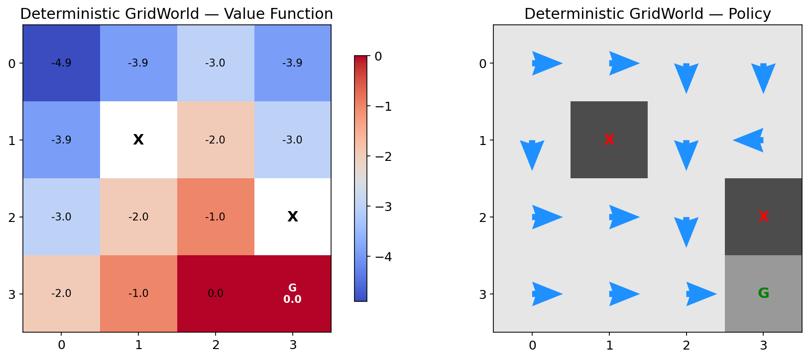
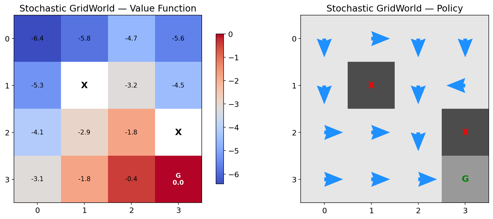
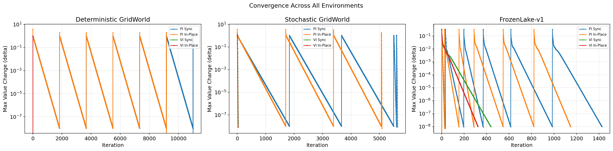
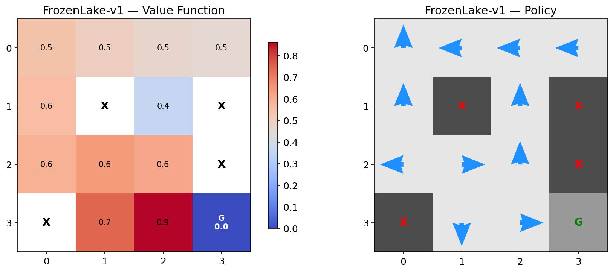

# Lab 2: Dynamic Programming

**MSDS 684 - Reinforcement Learning | Morgan Cooper**

## Overview

This project solves a known Markov Decision Process (MDP) using dynamic programming (DP). DP requires complete knowledge of the environment's transition model P(s',r|s,a), allowing us to focus on planning and developing an optimal policy rather than learning from interaction.

The project explores concepts from Sutton and Barto (2020) Chapter 4: policy evaluation, policy improvement, policy iteration, and value iteration. Four algorithm variants were implemented — synchronous and in-place versions of both policy iteration and value iteration.

## Environments

**Custom GridWorld:**
- State space: 16 discrete states (4x4 grid)
- Action space: 4 discrete (up, right, down, left)
- Rewards: -1 per step, 0 at goal
- Two configurations: deterministic (100% intended) and stochastic (80/10/10)
- Obstacles that block movement

**FrozenLake-v1:**
- State space: 16 discrete states (4x4 grid), from Gymnasium
- Action space: 4 discrete (left, down, right, up)
- Rewards: 0 per step, +1 for reaching the goal
- Terminal conditions: reaching the goal or falling into a hole
- Stochastic by default (1/3 probability for each direction)

## Key Results

In the deterministic environment, all four algorithms converged to the same optimal policy. States near the goal have values close to 0, whereas distant states are more negative due to the -1 step cost.



In the stochastic environment, values became more negative everywhere because actions no longer lead to guaranteed states. The policy shifted towards avoiding risky positions where a slip would cost the agent more penalty.



In-place algorithms converge quicker than synchronous algorithms because values propagate faster — each state immediately sees the previous state's updated value within the same sweep.



The same patterns held on FrozenLake-v1, validating that the implementation generalizes beyond the custom GridWorld.



## Setup

```bash
conda create -n rl-lab2 python=3.11 -y
conda activate rl-lab2
pip install -r requirements.txt
```

## Project Structure

```
├── lab2_dynamic_programming.ipynb   # Main notebook with all implementations
├── generate_report.py               # LaTeX report generator
├── requirements.txt                 # Python dependencies
├── figures/                         # Generated figures from notebook
└── Cooper_Morgan_Lab2.pdf           # Generated lab report
```

## References

- Sutton, R. S., & Barto, A. G. (2018). *Reinforcement learning: An introduction* (2nd ed.). MIT Press.
